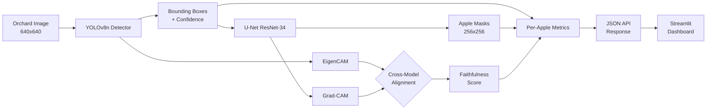
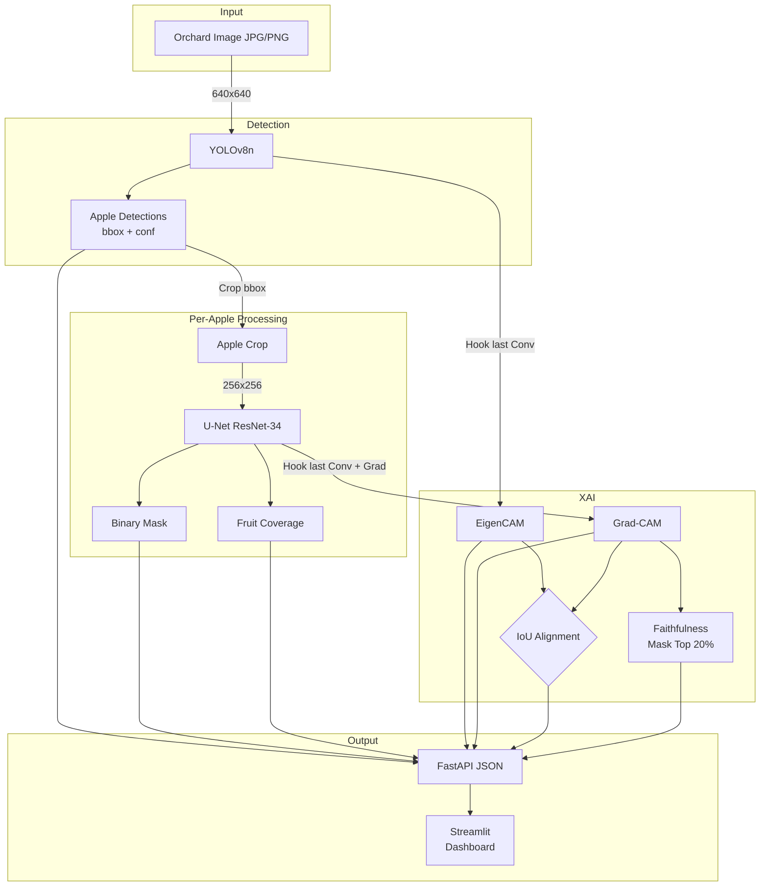

# Apple Orchard Monitor

Master's project: End-to-end Deep Learning computer vision system for Smart Agriculture.

## Overview

This system performs **real-time apple detection** and **fruit instance segmentation** on orchard images using:
- **YOLOv8n** for apple detection (merged Roboflow datasets, ~1,500 images)
- **U-Net (ResNet-34)** for precise apple boundary segmentation (SAM-generated masks)
- **Dual XAI**: EigenCAM (YOLO) + Grad-CAM (U-Net) with faithfulness and cross-model alignment metrics
- **FastAPI** backend + **Streamlit** frontend for deployment

## Pipeline



**Flow:** Upload image → Detect apples → Segment each apple → Explain both models → Return annotated results + XAI

## Project Structure

```
.
├── api/                       # FastAPI backend
│   ├── main.py               # API endpoints
│   ├── inference.py          # Model loading & inference
│   └── schemas.py            # Pydantic request/response models
├── explainability/           # XAI modules
│   ├── eigencam_yolo.py
│   ├── gradcam_unet.py
│   ├── faithfulness.py
│   ├── alignment.py
│   └── visualize.py
├── frontend/                 # Streamlit UI
│   └── app.py
├── training/                 # Training & evaluation scripts
│   └── evaluate.py
├── models/                   # Trained model weights
│   ├── yolov8_apple.pt       # Apple detection (YOLOv8n)
│   └── unet_fruit.pth        # Fruit segmentation
├── presentation/           # Slidev slides for defense
│   ├── slides.md
│   └── package.json
├── config.yaml               # Central configuration
├── requirements.txt          # Python dependencies
├── Dockerfile                # Container definition
├── README.md                 # This file
├── REPORT.md                 # Technical report
└── PROJECT_BRIEF.md        # Project scope and design decisions
```

## Quick Start

### 1. Install Dependencies

```bash
pip install -r requirements.txt
```

### 2. Start FastAPI Backend

```bash
uvicorn api.main:app --host 0.0.0.0 --port 8000 --reload
```

API docs available at: http://localhost:8000/docs

### 3. Start Streamlit Frontend

```bash
streamlit run frontend/app.py
```

Open: http://localhost:8501

### 4. Run Evaluation

```bash
python training/evaluate.py --test_dir path/to/test/images --save_viz
```

## Training

Model training performed on Google Colab (T4 GPU) using merged Roboflow datasets:
- `paramee/apple-tiyxx` (~216 images)
- `l61l/apple-desti` (~1,270 images)

**Training notebooks:**
- YOLO: `training/train_apple_roboflow_colab.ipynb`
- U-Net: `training/train_unet_apple_colab.ipynb`

### YOLOv8n Detection Results (100 epochs)

| Metric | Value |
|--------|-------|
| mAP@0.5 | **98.6%** |
| mAP@0.5:95 | **82.7%** |
| Precision | 95.8% |
| Recall | 97.0% |

### U-Net Segmentation Results (14 epochs, early stopping)

| Metric | Value |
|--------|-------|
| Best Val Loss | **0.324** |
| Train Loss (final) | 0.330 |
| Training Data | 884 images (SAM masks) |
| Validation Data | 156 images |

## Benchmarks

### Pipeline Detail



End-to-end pipeline evaluated on 30 COCO apple images (CPU, Intel i5):

| Component | Metric | Value |
|-----------|--------|-------|
| **Detection** | Total detections (30 imgs) | 33 apples |
| **Detection** | Avg per image | 1.1 apples |
| **Segmentation** | Fruits segmented | 33 |
| **XAI** | Avg Faithfulness | **0.302** |
| **XAI** | Avg Confidence Drop | **0.146** |
| **XAI** | Avg CAM Alignment (IoU) | 0.015 |

### Inference Speed (CPU)

| Pipeline Stage | Latency | Throughput |
|----------------|---------|------------|
| YOLO Detection only | ~82 ms | **12.2 FPS** |
| Detection + Segmentation | ~107 ms | **9.3 FPS** |
| Full Pipeline (+XAI) | ~68 ms | **14.7 FPS** |

*Note: XAI cache effects explain faster full-pipeline timing on repeated runs.*

## Report

A formal project report is available as a compiled PDF:

**[View Report (PDF)](./latex_report/main.pdf)**

The LaTeX source is in `latex_report/main.tex`.

## API Endpoints

| Endpoint | Method | Description |
|----------|--------|-------------|
| `/health` | GET | Server & model status |
| `/detect` | POST | YOLO detection only |
| `/segment` | POST | Detection + fruit segmentation |
| `/analyze` | POST | Full pipeline + XAI |
| `/explain` | POST | Explainability for a specific bbox |

## Configuration

All paths and hyperparameters are in `config.yaml`:
- Model weights paths
- Confidence thresholds
- Image sizes
- Class names & colors
- XAI parameters

## Classes

| ID | Name |
|----|------|
| 0 | apple |

## Docker

```bash
docker build -t apple-monitor .
docker run -p 8000:8000 apple-monitor
```


## License

Academic use only -- Master's project submission.
