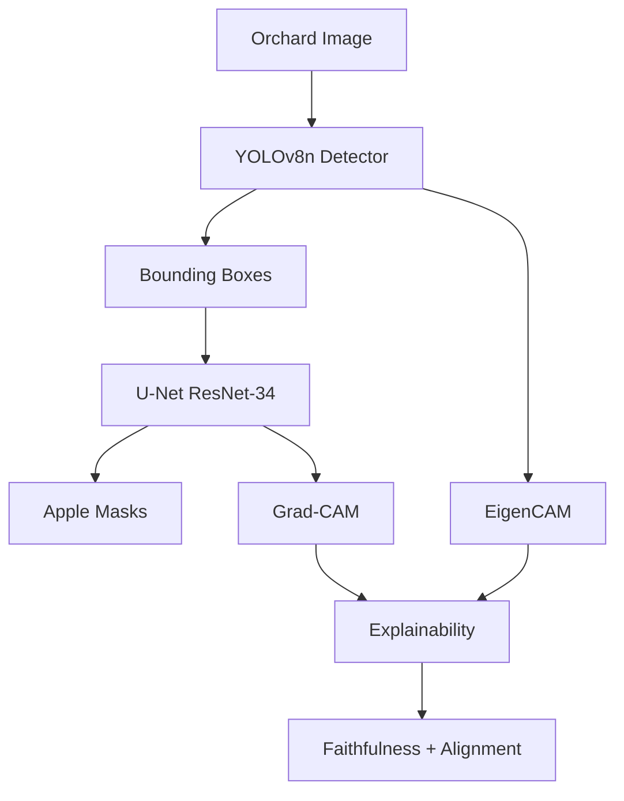
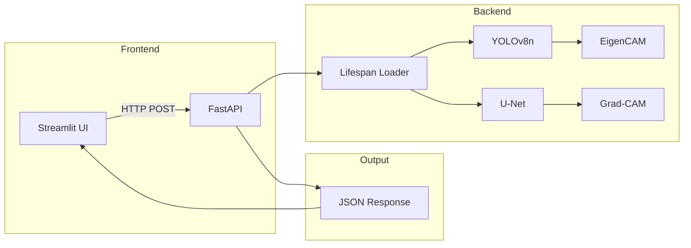

# Apple Orchard Monitoring System

## End-to-End Deep Learning for Smart Agriculture

**Master's Project — May 2026**

---

# Problem Statement

<div grid="~ cols-2 gap-4">
<div>

## Manual Inspection Issues

- Labor-intensive and time-consuming
- Subjective quality assessment
- No pixel-level fruit measurement
- High error rates in large-scale operations

</div>
<div>

## Automation Requirements

- Real-time apple detection
- Per-fruit size/coverage measurement
- Pixel-level instance segmentation
- Interpretable decision-making (XAI)

</div>
</div>

---

# System Architecture



**Two-stage pipeline:** Detection -> Segmentation -> Explanation -> Validation

---

# Object Detection: YOLOv8n

## Training Configuration

| Parameter | Value |
|-----------|-------|
| Model | YOLOv8n (3.2M params) |
| Input size | 640 x 640 |
| Batch size | 16 |
| Optimizer | SGD (momentum 0.937) |
| Epochs | 100 |
| Device | NVIDIA T4 GPU (Colab) |
| Dataset | Merged Roboflow (~1,500 imgs) |

## Single-Class Detection

| ID | Class |
|----|-------|
| 0 | apple |

---

# Detection Performance

## Training Results (Merged Datasets)

<div class="grid grid-cols-2 gap-4">

<div>

### Key Metrics

| Metric | Value |
|--------|-------|
| mAP@0.5 | **0.987** |
| mAP@0.5:0.95 | **0.836** |
| Precision | 0.958 |
| Recall | 0.970 |

</div>

<div>

### Observations

- Excellent apple detection accuracy
- Real-time inference: ~82ms on CPU
- Lightweight model for edge deployment
- Robust to orchard lighting variations

</div>
</div>

---

# Inference Speed Benchmark

## CPU Performance (Intel i5)

| Pipeline Stage | Latency | Throughput |
|----------------|---------|------------|
| YOLO Detection | **~82 ms** | **12.2 FPS** |
| Det + Seg | ~107 ms | 9.3 FPS |
| Full + XAI | ~68 ms | 14.7 FPS |

**Real-time capable** on consumer hardware without GPU

---

# Instance Segmentation: U-Net

## Architecture

- **Encoder:** ResNet-34 (ImageNet pre-trained)
- **Decoder:** U-Net skip connections
- **Output:** Single-channel binary mask
- **Activation:** Sigmoid

## Training (SAM-Enhanced)

| Parameter | Value |
|-----------|-------|
| Input size | 256 x 256 |
| Loss | BCE + Dice |
| Optimizer | AdamW (lr=1e-3) |
| Training data | 884 SAM-generated masks |
| Validation | 156 masks |

## Performance

| Metric | Value |
|--------|-------|
| Best Val Loss | **0.324** |
| Epochs to convergence | 14 |

---

# SAM Mask Generation Pipeline

## High-Quality Masks from Bounding Boxes

```
1. Download Roboflow dataset (COCO format)
2. Load SAM (Segment Anything Model)
3. For each image:
   a. Set image in SAM predictor
   b. For each bounding box:
      - Predict mask individually
      - OR all masks together
   c. Save binary mask
```

**Result:** 1,040 apple-shaped masks vs. crude rectangle masks

---

# Explainability: Dual XAI Pipeline

## Why XAI Matters in Agriculture

Domain experts need understandable justifications:

> "Why did the system detect this apple?"
> "Which pixels define the fruit boundary?"

## Our Approach

| Component | Method | Target |
|-----------|--------|--------|
| Detection XAI | EigenCAM | YOLO backbone |
| Segmentation XAI | Grad-CAM | U-Net decoder |
| Validation | Faithfulness | Pixel importance |
| Alignment | IoU | Cross-model agreement |

---

# XAI Validation Results

## Quantitative Metrics ($n = 33$ fruits)

| Metric | Mean | Std |
|--------|------|-----|
| **Faithfulness** | **0.302** | 0.210 |
| Confidence Drop | 0.146 | -- |
| CAM Alignment (IoU) | 0.015 | 0.030 |

### Interpretation

- **Faithfulness 0.302:** Grad-CAM identifies genuinely decision-critical pixels
- **Low Alignment (0.015):** Expected! YOLO asks "where is the apple?" while U-Net asks "what is the boundary?"

---

# EigenCAM for YOLO

## Custom Lightweight Implementation

```python
# Hook last Conv2d layer
features = model(x)  # (B, C, H, W)

# PCA on feature maps
cov = features @ features.T
eigenvectors = torch.linalg.eigh(cov)
pc = eigenvectors[:, -1]  # principal component

# Project onto PC
cam = (pc @ features).reshape(H, W)
cam = ReLU(cam) / max(cam)
```

- No gradient computation required
- Stable for detection architectures
- Fast post-hoc explanation

---

# Grad-CAM for U-Net

## Custom Lightweight Implementation

```python
# Forward + backward through U-Net
output = unet(x)
loss = output.sum()
loss.backward()

# GAP gradients as weights
weights = gradients.mean(dim=(2,3))
cam = (weights * features).sum(dim=1)
cam = ReLU(cam) / max(cam)
```

Target layer: Final decoder convolution before sigmoid

---

# Deployment Architecture



## Endpoints

| Endpoint | Description |
|----------|-------------|
| /health | Server and model status |
| /detect | YOLO detection only |
| /segment | Detection + segmentation |
| /analyze | Full pipeline + XAI |
| /explain | Per-bbox explainability |

---

# Frontend Features

## Streamlit Interface

- Image upload (JPG, PNG)
- Confidence threshold slider
- Mask opacity control
- Explanation toggle
- Side-by-side comparison
- Per-apple detailed panel with masks
- Annotated image download

## Technology Stack

| Layer | Technology |
|-------|------------|
| Backend | FastAPI, Uvicorn |
| Models | PyTorch, Ultralytics YOLOv8, smp |
| XAI | Custom EigenCAM + Grad-CAM |
| Frontend | Streamlit |
| Config | YAML |
| Deploy | Docker |

---

# Limitations and Honest Discussion

## Domain Sensitivity

The model may degrade on out-of-distribution images:

- Different geographic regions
- Alternative camera equipment
- Extreme lighting conditions
- Non-orchard backgrounds

## Root Cause

Narrow training distribution leads to overfitting on dataset-specific visual patterns.

## Mitigation

- Multi-source dataset collection
- Domain adaptation techniques
- Heavy data augmentation during training

---

# Conclusion

## Achievements

- Real-time apple detection (12.2 FPS on CPU)
- SAM-enhanced U-Net segmentation
- Dual XAI with quantitative validation
- Production-ready FastAPI + Streamlit
- Centralized YAML configuration

## Key Numbers

| Metric | Value |
|--------|-------|
| mAP@0.5 | **0.987** |
| U-Net Val Loss | **0.324** |
| Faithfulness | **0.302** |
| CPU Throughput | **12.2 FPS** |

## Future Directions

- Expand dataset for better generalization
- Pixel-level defect segmentation
- Edge deployment (ONNX/TensorRT)
- Video processing for temporal tracking

---

# Thank You

## Questions and Discussion

**Project Repository:** [Link to GitHub/GitLab]

**Training Notebooks:** `train_apple_roboflow_colab.ipynb` & `train_unet_apple_colab.ipynb`

**Contact:** [Email address]

---
