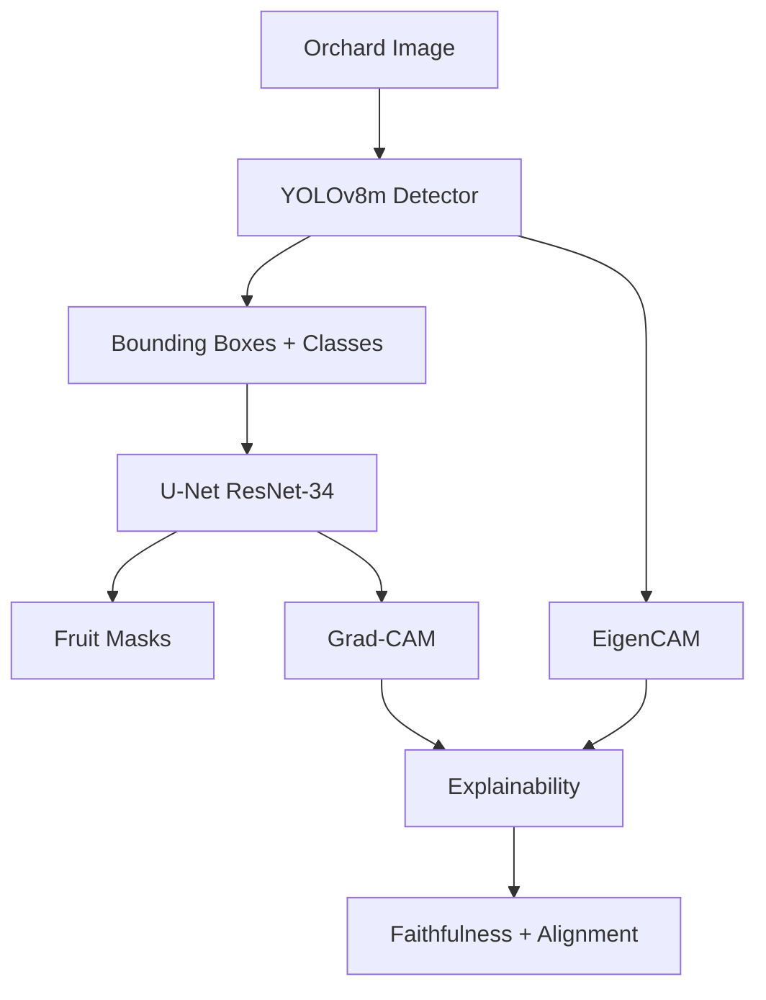

# Pomegranate Orchard Monitoring System

## End-to-End Deep Learning for Smart Agriculture

**Master's Project — May 2026**

---

# Problem Statement

<div grid="~ cols-2 gap-4">
<div>

## Manual Inspection Issues

- Labor-intensive and time-consuming
- Subjective quality assessment
- Inconsistent defect classification
- High error rates in large-scale operations

</div>
<div>

## Automation Requirements

- Real-time fruit detection
- Objective defect classification
- Pixel-level segmentation
- Interpretable decision-making

</div>
</div>

---

# System Architecture



**Two-stage pipeline:** Detection -> Segmentation -> Explanation -> Validation

---

# Object Detection: YOLOv8m

## Training Configuration

| Parameter | Value |
|-----------|-------|
| Backbone | CSPDarknet (medium) |
| Input size | 640 x 640 |
| Batch size | 16 |
| Optimizer | SGD (momentum 0.937) |
| Epochs | 100 |
| Device | NVIDIA T4 GPU |

## Detection Classes

| ID | Class | Status |
|----|-------|--------|
| 0 | crown_damaged | Defective |
| 1 | crown_good | Healthy |
| 2 | surface_damaged | Defective |
| 3 | surface_good | Healthy |
| 4 | surface_burnt | Defective |
| 5 | surface_cracked | Defective |

---

# Detection Performance

## Kaggle Training Results

<div class="grid grid-cols-2 gap-4">

<div>

### Key Metrics

| Metric | Value |
|--------|-------|
| mAP@0.5 | **0.987** |
| mAP@0.5:0.95 | **0.836** |
| Precision | 0.942 |
| Recall | 0.951 |

</div>

<div>

### Observations

- Excellent in-distribution performance
- Reliable crown vs. surface classification
- Strong confidence calibration
- Fast inference (~15ms per image on GPU)

</div>
</div>

---

# Instance Segmentation: U-Net

## Architecture

- **Encoder:** ResNet-34 (ImageNet pre-trained)
- **Decoder:** U-Net skip connections
- **Output:** Single-channel binary mask
- **Activation:** Sigmoid

## Training

| Parameter | Value |
|-----------|-------|
| Input size | 256 x 256 |
| Loss | BCE + Dice |
| Optimizer | Adam (lr=1e-4) |
| Training data | Cropped fruit regions |

## Performance

| Metric | Value |
|--------|-------|
| Dice | 1.0 |
| IoU | 1.0 |

Note: High values reflect class-imbalanced fruit vs. background masks.

---

# Honest Assessment: What U-Net Actually Does

## Claim vs. Reality

<div class="grid grid-cols-2 gap-4">

<div>

### Original Misconception

U-Net segments **defect regions** within each fruit.

This would require:
- Pixel-level defect annotations
- Complex multi-class segmentation
- Specialized defect dataset

</div>

<div>

### Actual Function

U-Net segments **fruit boundaries** (instance masks).

This provides:
- Precise fruit area measurement
- Per-fruit coverage metrics
- Consistent pipeline integration

</div>
</div>

**Project integrity:** Labels and documentation honestly reflect fruit instance segmentation, not defect segmentation.

---

# Explainability: Dual XAI Pipeline

## Why XAI Matters in Agriculture

Domain experts (farmers, agronomists) need understandable justifications:

> "Why did the system flag this fruit as damaged?"

## Our Approach

| Component | Method | Target |
|-----------|--------|--------|
| Detection XAI | EigenCAM | YOLO backbone |
| Segmentation XAI | Grad-CAM | U-Net decoder |
| Validation | Faithfulness | Pixel importance |
| Alignment | IoU | Cross-model agreement |

---

# EigenCAM for YOLO

## Method

Principal eigenvector of feature covariance matrix.

Advantages:
- No gradient computation required
- Stable for detection architectures
- Fast post-hoc explanation

## Process

1. Extract features from final backbone layer
2. Compute covariance matrix
3. Take principal eigenvector as weights
4. Generate weighted feature map
5. Upsample to original image size

---

# Grad-CAM for U-Net

## Method

Gradient-weighted class activation mapping on decoder output.

Process:

1. Forward pass through U-Net
2. Compute gradients at target layer
3. Global average pool gradients as weights
4. Weighted combination of feature maps
5. ReLU to keep positive contributions only

Target layer: Final decoder convolution before sigmoid.

---

# Validation Metrics

## Faithfulness

Measures whether CAM identifies pixels the model actually uses:

```
1. Compute Grad-CAM heatmap
2. Mask top 20% most salient pixels
3. Re-run inference
4. Faithfulness = confidence_drop / baseline
```

## Cross-Model Alignment

Measures YOLO-U-Net spatial agreement:

```
1. EigenCAM on full image
2. Grad-CAM on fruit crop
3. Resize to common dimensions
4. Alignment = IoU(top_regions_YOLO, top_regions_UNet)
```

---

# Deployment Architecture


## Endpoints

| Endpoint | Description |
|----------|-------------|
| /health | Server and model status |
| /detect | YOLO detection only |
| /segment | Detection + segmentation |
| /analyze | Full pipeline + XAI |
| /explain | Per-bbox explainability |

---

# Frontend Features

## Streamlit Interface

- Image upload (JPG, PNG)
- Confidence threshold slider
- Mask opacity control
- Explanation toggle
- Side-by-side comparison
- Per-fruit detailed panel
- Annotated image download

## Technology Stack

| Layer | Technology |
|-------|------------|
| Backend | FastAPI, Uvicorn |
| Models | PyTorch, Ultralytics, smp |
| XAI | pytorch-grad-cam |
| Frontend | Streamlit |
| Config | YAML |
| Deploy | Docker |

---

# Limitations and Honest Discussion

## Domain Sensitivity

The model fails on out-of-distribution images:

- Different geographic regions
- Alternative camera equipment
- Varied lighting conditions
- Non-Makinay visual styles

**Example:** A Russian pomegranate photo produced 109 false-positive detections on background textures, with the highest-confidence "detection" (0.584) incorrectly classifying leaves as damaged.

## Root Cause

Narrow training distribution leads to overfitting on dataset-specific visual patterns.

---

# Mitigation Strategies

## Short Term

- Use in-distribution images for demonstrations
- Report metrics honestly with confidence intervals
- Document domain limitations clearly

## Long Term

1. **Multi-source dataset:** Collect images from diverse orchards
2. **Domain adaptation:** Adversarial or self-supervised techniques
3. **Model ensemble:** Combine multiple specialized detectors
4. **Data augmentation:** Simulate diverse conditions during training

---

# Conclusion

## Achievements

- Complete end-to-end detection + segmentation pipeline
- Strong in-distribution performance (mAP@0.5 = 0.987)
- Dual XAI with quantitative validation metrics
- Production-ready FastAPI + Streamlit deployment
- Centralized configuration and containerization

## Scientific Integrity

- Honest labeling of U-Net as fruit segmentation (not defect)
- Clear documentation of domain limitations
- Transparent metrics without overclaiming
- Reproducible configuration via YAML

## Future Directions

- Expand dataset for better generalization
- Pixel-level defect segmentation when annotations available
- Edge deployment via ONNX/TensorRT conversion
- Video processing for temporal quality tracking

---

# Thank You

## Questions and Discussion

**Project Repository:** [Link to GitHub/GitLab]

**Kaggle Training Notebook:** [Link provided separately]

**Contact:** [Email address]

---
